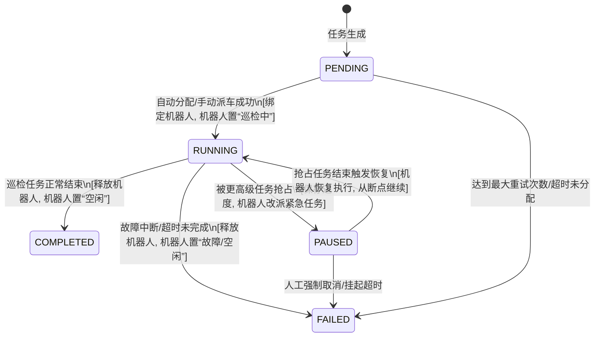

# 自动调度引擎算法实现说明

> 文档目标：供算法工程师基于此说明实现自动调度算法，并供测试人员基于此进行验证。
> 对应模块：模块二「调度引擎与任务中心」— 自动调度算法
> 相关 ADR：0004（计划解耦机器人）、0005（选车规则归属调度规则页）、0006（资源池 vs 调度规则边界）、0007（抢占分级授权）、0008（任务状态机扩展）

---

## 1. 算法总览

自动调度引擎负责 **"谁去干、怎么去"** 的决策。它接收上游 L3 任务生成层（Task Injection Layer）投递的 DAG 任务集，为每个待执行任务分配最优的机器人，并在资源冲突/紧急场景下执行抢占逻辑。

整体流程分三段：

```
输入：待调度任务 + 当前系统状态
  ↓
第一阶段：候选机器人筛选（资源池+可用性过滤）
  ↓
第二阶段：候选机器人排序（多因子加权打分）
  ↓
第三阶段：决策输出（直接分配 / 抢占 / 待处理裁决）
  ↓
输出：分配结果（机器人 ID / 抢占动作 / 待处理标记）
```

---

## 2. 输入数据

调度引擎每次执行时需要以下三类输入：

### 2.1 待调度任务上下文

调度引擎需要从待调度任务中读取以下字段来做决策：

| 字段 | 说明 | 备注 |
|---|---|---|
| 任务 ID | 任务唯一标识 | 必填 |
| 所属区域 ID | 任务所在区域 | 用于区域资源池和机器人偏好匹配 |
| 业务场景 | 日常巡检 / 隐患排查 / 环境检测 / 作业监护 / 作业票监护 / 紧急到场 | 必填，用于匹配调度规则和疲劳段 |
| 风险等级 | 正常 / 预警 / 告警 / 重大告警 / 隐患 / 重大隐患 | 必填 |
| 优先级 | 常规 / 高 / 紧急 | 决策因子，紧急到场和作业票监护默认设为紧急 |
| 任务来源 | 计划派生 / 调度插入 / 自动复核 / 作业票 / 第三方 / 紧急 / 手动 | 必填 |
| 关联路线 ID | 用于定位执行区域和计算距离 | 必填 |
| 设备能力需求 | 任务是否需要云台扫描、气体检测、升降柱等特殊能力 | 用于硬性能力筛选过滤 |
| 预估执行时长 | 系统估算的分钟数 | 可选，用于负载均衡评估 |

### 2.2 机器人资源状态

调度引擎需要实时获取每个机器人的以下信息：

| 字段 | 说明 | 备注 |
|---|---|---|
| 机器人 ID | 唯一标识 | 必填 |
| 状态 | 在线 / 离线 / 充电中 / 巡检中 / 故障 / 暂停 / 返航中 | 用于筛选空闲/繁忙状态及参与抢占决策 |
| 当前电量百分比 | 0~100 | 低于 20% 触发低电量保护过滤，同时作为排序权重因子 |
| 当前位置 | 关联路网导航点 ID | 用于计算与任务入口点的路网/几何距离 |
| 当前任务 ID | 正在执行的任务唯一标识 | 用于判定机器人当前的关联任务上下文 |
| 当前任务进度 | 0~100 百分比 | 在抢占分配时，用于评估剩余时长，优先抢占进度高（接近完成）的机器人 |
| 挂载能力清单 | 该机器人具备哪些检测能力（如测温、测气、云台、升降等） | 用于与任务设备能力需求做硬性匹配过滤 |
| 最后在线时间 | 时间戳 | 用于机器人存活状态判定 |
| 所属区域 ID 列表 | 该机器人隶属的区域池 | 用于筛选候选池与外区域池 |

### 2.3 调度规则配置

调度规则配置定义了自动调度的运行策略，每条配置包含以下信息：

- 疲劳段名称（如"中午疲劳段"、"夜间疲劳段"）
- 起始时间 HH:mm
- 结束时间 HH:mm
- 频次倍率（如 2.0 表示加密至 2 倍）
- 优先级升级目标级别（常规→高，或高→紧急）
- 适用的业务场景列表（只有这些场景才受此疲劳段影响）
- 最低风险等级门槛（只有达到该等级以上的任务才受此疲劳段影响）
- 是否启用

### 2.4 资源池配置

资源池配置用于定义机器人与区域的绑定偏好与硬性限制，主要包含三部分：

1. **优先指派机器人列表** — 这是本区域的"软偏好候选池"。调度引擎在派车时优先从这份列表中挑选机器人，但这是软偏好而不是硬绑定——候选池全没空时调度引擎可以溢出到外区域调用空闲机器人。

2. **机器人禁用时段** — 按机器人维度配置的时间窗口列表。每项包含：机器人 ID、起始时间 HH:mm、结束时间 HH:mm、原因（可选）。在当前时间落在禁用时段内时，调度引擎跳该机器人。

3. **机型兼容白名单** — 机型与区域的兼容关系列表。每项包含：机型名称、允许的区域 ID 列表。调度引擎在派车时检查任务所属区域是否在该机型允许的范围内。

---

## 3. 算法流程详解

### 第一阶段：候选机器人筛选

调度引擎拿到全量机器人和资源池配置后，依次做四层过滤：

**第一层：基础可用性过滤（硬条件，不满足直接排除）**

- 状态为离线、故障或暂停的机器人 → 跳过
- 电量 ≤ 20% 的机器人 → 跳过（低电量保护阈值）
- 任务要求云台功能但机器人无云台 → 跳过
- 任务要求气体检测但机器人无气体传感器 → 跳过
- 任务要求升降柱但机器人无升降柱 → 跳过

**第二层：区域偏好过滤（区分候选池与外区域）**

根据任务所属区域 ID，查找该区域的资源池配置：

- 如果找到了资源池：池内的 preferredRobotIds 列表中的机器人划入「候选池」，其余机器人划入「外区域池」
- 如果没找到资源池：候选池为空，所有可用机器人划入外区域池

**第三层：禁用时段过滤**

获取当前时间（HH:mm），遍历候选池和外区域池中的所有机器人。如果某个机器人当前时间落在其禁用时段内（来自资源池配置的 disabledTimeWindows），则从列表中移除。

**第四层：机型兼容过滤**

如果资源池配置了机型兼容白名单（robotTypeWhitelist），则只保留机型在白名单内且任务所属区域 ID 在允许列表中的机器人。

**输出：** 两个列表——候选池机器人列表 + 外区域机器人列表。候选池优先参与排序，外区域池作为溢出兜底。

---

### 第二阶段：多因子排序打分

对候选池内的机器人做加权打分排序。**外区域机器人只在候选池为空时才参与排序**（溢出兜底）。

#### 评分因子与权重

每个参与排序的机器人按以下 5 个维度打分，最终得分 = 各因子加权求和 - 扣分惩罚：

| 因子 | 权重 | 评分规则 |
|---|---|---|
| **就近距离** | 0.30 | 计算机器人当前位置到任务入口的路径距离。对参选池内各机器人的距离做归一化处理：距离最近者 100 分，最远者 0 分，中间线性插值。归一化公式：`(最大距离 - 该机器人距离) ÷ (最大距离 - 最小距离) × 100`（若只有一个机器人参选，或最大距离与最小距离相等，则给 100 分）。 |
| **电量充裕度** | 0.25 | 以 20% 为最低可用线，100% 为满分。计算公式：`(当前电量 - 20) ÷ 80 × 100`。例如 90% 电量得 87.5 分，50% 电量得 37.5 分。 |
| **负载空闲度** | 0.20 | 按当前状态打分：无任务在身 = 100 分，正在充电 = 80 分，正在返航 = 60 分，正在执行任务 = 按进度剩余比例打分（已完成 70% 则得 30 分）。 |
| **机型匹配度** | 0.15 | 对比任务所需能力与机器人的挂载能力。完全覆盖所有能力需求 = 100 分，部分覆盖 = 50 分，完全不匹配 = 0 分。 |
| **历史偏好** | 0.10 | 在候选池内的机器人 = 100 分，外区域机器人 = 50 分。 |

> **关于权重**：以上为初始默认值，就近距离权重最高（0.30），符合安全总监"就近空闲机器人"的核心诉求。后续迭代可将权重暴露为可配置参数。

#### 评分归一化保证

1. **基础打分归一化**：各评估因子的打分范围均限制在 `[0, 100]`，且权重之和严格等于 `1.0`。因此，任何机器人的基础加权总分天然落于 `[0, 100]` 区间内。
2. **绝对分值锁定**：任何后续的惩罚或修正计算都必须确保最终输出的 `综合得分` 限制在 `[0, 100]` 闭区间内（通过 `Math.max(0, Math.min(100, score))` 截断）。

#### 外区域溢出惩罚规则

为了防止外区域机器人被频繁跨区调度，造成资源利用不均和路途损耗，引入**跨区域惩罚机制**：
- **跨区域扣分 (Cross-Area Penalty)**：如果参与排序的机器人来自“外区域池”（即候选池为空时的溢出调度），其最终得分将直接**扣除 20 分**的跨区域调度成本（可配置）。
- **公式**：`综合得分 = Math.max(0, (∑(因子得分 × 权重) - 跨区域扣分))`。

#### 疲劳段修正

调度引擎在执行排序前需先判断当前时间是否落在某个已启用的疲劳段内。判定条件：

- 当前时间在疲劳段的 startTime ~ endTime 范围内（注意跨天情况，如夜间段 22:00~06:00）
- 待调度任务的业务场景在疲劳段的适用场景列表中
- 待调度任务的风险等级 ≥ 疲劳段的最低门槛

如果同时满足以上条件，则进行以下修正：

1. **优先级提升限制**：将该任务的优先级提升至疲劳段配置的级别（常规 → 高）。**注意：疲劳段最高仅允许将任务升级至「高」（HIGH）优先级，绝对禁止升级至「紧急」（EMERGENCY）。**「紧急」优先级只能由系统预设的真实紧急事件（如紧急到场、作业票监护、火警等）触发，避免疲劳段过度升级导致真正的紧急任务被挤压。
2. **频次倍率修正**：疲劳段的频次倍率（如 2.0）**仅作用于计划派生阶段的任务生成频率**（即任务派发间隔缩短至原来的 1/倍率），**绝不参与调度阶段机器人打分的乘法计算**。这从根本上杜绝了“排序 + 优先级”双重放大导致的策略失真，同时确保了评分的严格归一化。

**注意**：疲劳段修正只影响**当前正在分配**的任务，不影响已在执行中的机器人评分。避免因疲劳段导致对执行中任务产生频繁的、不公平的抢占。

---

### 第三阶段：决策输出

根据前两阶段的结果，分三种路径处理：

#### 路径 A：正常分配（候选池优先，溢出兜底）

**触发条件**：候选池或外区域池有可用机器人。

**执行动作**：
1. 优先从候选池中取得分最高的机器人
2. 如果候选池为空，则从外区域池中取得分最高的机器人（溢出兜底）
3. 将该机器人的 ID 写入任务的分配字段
4. 更新该机器人状态为"巡检中"
5. 返回分配成功的结果

#### 路径 B：抢占分配（高优先级任务抢占低优先级）

**触发条件**：
- 候选池和外区域池均无可用的空闲机器人（全部都在忙碌）
- 当前任务的优先级为「紧急」（emergency），或业务场景为「紧急到场」/「作业票监护」
- 存在至少一个正在执行中的、优先级更低的任务，且该任务满足以下**防抖动与稳定性约束**。

**防抖动与稳定性约束（Thrashing Control）**：
为了避免任务频繁抢占与恢复导致机器人“反复横跳”（抖动），必须满足以下硬性约束：
1. **抢占冷却时间 (Preemption Cooldown)**：任何曾被抢占并重新恢复执行的任务，在恢复运行后的 **10 分钟内** 进入保护期，禁止再次被抢占。
2. **最小运行时间限制 (Min Execution Duration)**：目标被抢占任务自开始执行（或恢复执行）起，累计运行时间必须 **大于等于 3 分钟**。未满 3 分钟的任务不得被抢占。
3. **同任务单次抢占锁定**：如果任务 A 已经抢占过机器人 1 执行的任务 B，在任务 A 结束或释放前，任务 B 无法通过任何自动机制反向抢占机器人 1（即使任务 B 在其他维度符合抢占要求）。

**执行动作**：
1. 在所有忙碌的机器人中，筛选出正在执行优先级低于当前任务的机器人列表。
2. 过滤掉不满足上述**防抖动与稳定性约束**的机器人。
3. 如果仍有多个候选机器人，按以下规则依次决出被抢占者：
   - 优先选择执行任务优先级最低的机器人。
   - 若执行任务优先级相同，选择当前任务进度百分比最高的机器人（即快要执行完毕的那台，最大程度减少重做成本）。
4. 将被抢占的低优先级任务的状态置为「已暂停」（PAUSED），记录当前执行进度与已完成的巡检点 ID。
5. 写入审计日志（触发任务 ID、操作时间、被抢占任务 ID、机器人 ID、抢占前后状态、原因）。
6. 将当前紧急任务分配给这台机器人，机器人中止当前动作，立即前往执行紧急任务。

**抢占分级规则**（ADR 0007 简化版）：

| 触发场景 | 授权级别 | 行为说明 |
|---|---|---|
| 紧急到场 / 作业票监护 | 自动抢占 | 无需调度员确认，直接触发抢占。抢占后弹出审计表单要求调度员填写原因 |
| 高优先级计划派生任务 | 需人工确认 | 不直接抢占，任务置为「待处理」（PENDING），弹窗提示调度员手动裁决 |

#### 路径 C：无可用资源 → 待处理

**触发条件**：
- 候选池和外区域池均无可用机器人
- 并且不满足抢占条件（或任务优先级不够触发抢占）

**执行动作**：
1. 将任务状态设为「待处理」（PENDING）
2. 在任务上记录冲突原因（如"所有机器人繁忙，无可用资源"）
3. 调度台界面显示该任务的待处理标记
4. 等待调度员手动处理

---

## 4. 关键子算法细节

### 4.1 就近距离计算方法

计算机器人当前位置到任务路线入口点的距离，用于"就近距离"因子的评分。

**路网距离方案（最终目标）：**

项目中的路网是一个有向图结构：节点是导航点（NavigationPoint），边是路段（RoadEdge，带 distance 字段）。最短路径算法采用 Dijkstra 或 A\*：

- 起点：机器人当前所在的导航点 ID
- 终点：任务路线的第一个导航点（入口点）
- 边权：路段的 distance
- 输出：最短路径总距离

**过渡期简化方案：**

如果路网图搜索计算较为复杂，可先退化为计算平面几何距离（根据导航点的经纬度坐标计算平面直线距离）。**但接口定义必须预留路网图搜索的参数位置**，后续升级为真实图搜索时不需改动调用方。

### 4.2 疲劳段对任务生成的影响

疲劳段不仅影响调度排序，还影响从计划到任务的派生频率：

当系统从计划派生出定时任务时，如果当前时间处于某个已启用的疲劳段内，并且该计划的业务场景和风险等级满足疲劳段门槛：

- 原本按正常频次生成的任务间隔除以频次倍率（如正常每 60 分钟一次，倍率 2.0 时改为每 30 分钟一次）
- 派生出的任务优先级提升至疲劳段配置的级别

### 4.3 多机器人防碰撞（扩展预留）

本调度规格暂不直接实现多机器人防碰撞路径规划。但算法设计应预留碰撞约束的扩展点：

未来在引入多车路径规划（VRP 求解）时，碰撞冲突可作为惩罚因子加入排序公式：

```
最终得分 = 基础得分 - 碰撞惩罚分
碰撞惩罚分 = 该机器人路径上冲突路段数量 × 冲突权重
```

每个冲突路段描述需要：路段 ID、占用该路段的机器人 ID、占用时间窗口（起始~结束）。

### 4.4 机器人能力匹配度逻辑

能力匹配度因子遵循以下规则：

1. 如果任务没有特殊能力要求（不需要云台、气体、升降柱），任何机器人在这个因子都得满分。
2. 如果任务有特殊能力要求，对比机器人的挂载能力：
   - 任务要求的每项能力，检查机器人是否具备
   - 完全匹配（所有要求的能力都具备）：100 分
   - 部分匹配（至少满足一项，但不是全部）：50 分
   - 完全不匹配：0 分
3. 能力匹配得分为 0 的机器人不会进入第一阶段的筛选结果。

---

### 4.5 并发控制与全局锁语义

为了应对多任务并发进入调度引擎时的“双分配”冲突（即任务 A 和任务 B 同时计算并把同一个可用机器人 1 分配给自己），系统必须引入原子性与并发一致性控制：

1. **单线程串行化调度（队列模式）**：
   - 调度引擎采用单线程任务队列进行派车决策。所有自动调度触发请求（包括定时计划触发、突发事件触发、手动批量派发）均投递到内存/Redis 中的“调度待处理队列”。
   - 引擎轮询队列，每次只对一个任务执行筛选、排序与分配计算，确保调度计算的单线程串行化。

2. **资源锁机制（互斥锁与悲观锁）**：
   - 在对特定任务开始计算机器人分配时，引擎会对该任务所属区域内的所有候选机器人尝试加锁。
   - **锁键名**：`lock:robot:${robotId}`。
   - **锁机制**：使用 Redis 分布式锁（或单机版内存 Mutex 锁），设置 5 秒极短过期时间（防止异常死锁）。
   - 如果锁获取失败，说明该机器人正被另一个并发调度计算（或手动派车）占用，直接将其从本次计算的可用列表中剔除。

3. **状态版本校验（CAS 乐观锁）**：
   - 即使有了串行化和资源锁，在最终决策写入数据库前，仍须校验机器人和任务的状态版本。
   - **写前校验**：在保存分配结果（如 `assigned` 或 `preempted`）的一瞬间，使用乐观锁更新：
     ```sql
     UPDATE robot SET status = '巡检中', current_task_id = 'task-A', version = version + 1
     WHERE id = 'robot-1' AND status IN ('在线', '充电中', '返航中') AND version = @old_version;
     ```
   - 若受影响行数为 0，说明在计算期间机器人状态已发生变动，本次调度决策失效，释放锁，任务重新排队进入调度队列。

---

### 4.6 任务生命周期与状态机严格绑定

任务的生命周期由一个闭环的有限状态机（FSM）进行控制。状态流转关系、触发事件和资源释放逻辑定义如下：

#### 4.6.1 状态机流转图 (Mermaid)



#### 4.6.2 状态流转规则与断点恢复逻辑

| 源状态 | 目标状态 | 触发条件 / 事件 | 业务逻辑与资源释放 |
|---|---|---|---|
| **PENDING** | **RUNNING** | 自动或手动调度成功找到可用机器人。 | 绑定机器人 ID，锁定机器人状态为 `巡检中`。 |
| **PENDING** | **FAILED** | 任务重试达上限（如 3 次）或停留在此状态超 30 分钟。 | 写入失败日志，触发调度台异常告警。不涉及机器人释放。 |
| **RUNNING** | **PAUSED** | 触发抢占分配（路径 B）。 | 1. 保存当前巡检点进度（如“已完成至第 4 个点”）；<br>2. 解绑机器人的 `current_task_id`（将其重定向到新紧急任务）；<br>3. 原任务挂起。 |
| **PAUSED** | **RUNNING** | 抢占该机器人的紧急任务执行完毕（变为 `COMPLETED` 或 `FAILED`）。 | **事件驱动恢复**：紧急任务结束事件触发监听，自动重新激活原任务，指派原机器人，状态恢复为 `RUNNING`，从保存的断点（Waypoint/点位）继续执行。 |
| **RUNNING** | **COMPLETED** | 机器人上报所有点位巡检完毕。 | **回流释放**：清空机器人 `current_task_id`，将机器人状态更新为 `空闲`（或若电量低于 30% 自动触发 `返航充电`），释放其占用的所有路网资源。 |
| **RUNNING** | **FAILED** | 机器人发生物理故障、网络离线超 5 分钟，或人工终止。 | **异常回流**：清空机器人当前任务，将机器人状态标记为 `故障` 或 `离线`，任务状态设为 `FAILED` 并记录详细失败原因。 |
| **PAUSED** | **FAILED** | 任务挂起超过设定时长（如 120 分钟）未被恢复，或调度员手动取消。 | 强制结束任务，释放所有挂起的任务上下文。 |

---

### 4.7 调度可观测性设计（指标体系与审计）

为保证调度算法能够持续评估和调优，调度引擎必须收集并输出以下指标（Metrics）至监控面板：

1. **核心可观测性指标 (Key Metrics)**:
   - **平均调度延迟 (Avg Dispatch Latency)**：从任务进入 `PENDING` 到变更为 `RUNNING` 的平均时间。
   - **抢占率/抢占频率 (Preemption Frequency)**：每日发生抢占的次数及占总调度任务的比例，用以评估“防抖动策略”的实际效果。
   - **机器人利用率 (Robot Utilization Rate)**：各个机器人处于活跃工作状态（如 `巡检中`、`返航中`）的时间占比。
   - **区域负载均衡指数 (Area Load Balancing Index)**：各个区域机器人平均负载负荷的差异度，防止特定外区域机器人被过度频繁调度。
   - **疲劳段命中率 (Fatigue Segment Hit Rate)**：命中了疲劳段规则的定时/即时任务占总任务的比例。

2. **审计与调试追踪**:
   - 每次自动调度引擎执行计算时，都必须输出一份包含决策因子得分明细的**调度审计日志 (Audit Log)**。

---

## 5. 调度引擎的输出

调度引擎每次执行完成后，需要返回以下信息：

| 输出字段 | 说明 |
|---|---|
| 任务 ID | 被调度分配的那个任务 |
| 结果类型 | **已分配**（assigned）/ **已抢占**（preempted）/ **待处理**（pending）三种之一 |
| 分配的机器人 ID | 结果类型为已分配或已抢占时提供 |
| 被抢占的任务 ID | 结果类型为已抢占时提供，记录哪个任务被挂起 |
| 是否被疲劳段升级 | 布尔值，标记该任务是否因疲劳段修正而提升了优先级 |
| 命中的疲劳段名称 | 如有疲劳段修正，记录对应的疲劳段名称 |
| 综合得分 | 被选中机器人的最终得分（必须在 `[0, 100]` 区间内） |
| 各项因子得分明细 | 各因子的独立得分（距离、电量、负载、机型匹配、偏好）以及**跨区域扣分**明细 |
| 并发冲突状态 | 记录是否在执行过程中发生了全局锁竞争重试、对应的乐观锁版本号 |
| 原因说明 | 结果为待处理时提供，说明具体原因（如"所有机器人繁忙"） |
| 审计日志 | 记录本次调度操作的审计信息：操作类型（分配/抢占/待处理）、操作方、目标对象 ID、时间戳 |

---

## 6. 边界与异常场景

| 场景 | 预期行为 |
|---|---|
| 所有机器人离线或故障 | 任务置为「待处理」，提示无可用资源 |
| 候选池机器人但是电量都不足 | 溢出到外区域取可用机器人 |
| 唯一可用机器人正在执行低优先级任务，新任务是紧急 | 触发抢占，低优任务挂起为「已暂停」，写审计日志（必须满足冷却时间和最小运行时间防抖约束） |
| 唯一可用机器人正在执行同优先级任务 | 不触发抢占，新任务置为「待处理」 |
| 多个候选机器人评分相同 | 按机器人 ID 字典序取第一个，保证确定性 |
| 疲劳段切换瞬间（如 13:30 结束） | 以实时系统时钟为准，不做缓冲过渡 |
| 机器人刚被分配出去，状态被外部改变 | 调度引擎每次执行前重新检查机器人最新状态，不做缓存假设 |
| 资源池配置完全为空（没有配置任何区域） | 所有可用机器人进入外区域池，按正常排序分配 |
| 机器人的 ID 在候选池中但该机器人已被删除 | 过滤步骤遇到不存在的 ID 直接跳过 |
| 候选机器人已被抢占锁定 (lock 状态) | 排除该机器人，继续对其他可用机器人打分，避免并发冲突 |
| 被抢占任务恢复保护期内再次遭遇紧急任务 | 任务处于 10 分钟恢复冷却期或运行未满 3 分钟，拒绝被抢占，新紧急任务寻找下一个目标或置为 PENDING |
| 跨区域调度频繁度过高 | 跨区域扣分机制降低外区机器人得分，使其优先让位于本地回流的机器人，并在统计指标中报警 |

---

## 7. 测试验证用例

### 7.1 单元测试用例

| 编号 | 测试场景 | 输入条件 | 期望结果 |
|---|---|---|---|
| 1 | 基本分配 | 区域 A 候选池有 2 台在线、电量充足的机器人 | 返回候选池内得分最高者 |
| 2 | 溢出兜底 | 区域 A 候选池为空，区域 B 有 1 台空闲机器人 | 返回区域 B 的机器人（溢出分配） |
| 3 | 电量排序优先 | 候选池 3 台机器人，电量分别为 90%、60%、30% | 得票最高者应为电量 90% 的（假设其他因子相同） |
| 4 | 就近排序优先 | 候选池 2 台机器人，距任务入口分别为 50 米和 200 米 | 得票最高者应为 50 米的 |
| 5 | 紧急任务抢占 | 所有机器人都忙，1 台正执行常规任务，新任务为紧急到场 | 抢占触发，常规任务变为已暂停，新任务分配成功 |
| 6 | 高优先但非紧急不抢占 | 同场景 5，但新任务优先级为 high 不是 emergency | 不抢占，新任务置为待处理 |
| 7 | 疲劳段得分上浮 | 午间 12:30，频次倍率 2.0 | 任务综合得分翻倍，优先级升至 high |
| 8 | 禁用时段过滤 | 机器人 A 当前在禁用时段内 | 机器人 A 被从候选列表中移除 |
| 9 | 机型不兼容过滤 | 任务需要云台能力，机器人无云台 | 该机器人被跳过 |
| 10 | 全过滤后无可用机器人 | 所有条件过滤后无机器人可用 | 返回待处理，提示无可用资源 |
| 11 | 候选池与外区域都有空闲 | 候选池 1 台+外区域 1 台 | 优先取候选池内的机器人（即使外区域分更高） |

### 7.2 集成测试场景

| 编号 | 测试场景 | 操作步骤 | 预期结果 |
|---|---|---|---|
| 1 | 完整自动派车流程 | 创建计划（不指定机器人）→ 派生任务 → 触发自动调度 | 任务自动绑定到机器人，状态流转正常 |
| 2 | 抢占后恢复 | 抢占触发 → 低优任务变为已暂停 → 紧急任务完成 → 低优任务自动恢复 | 状态机完整流转，审计日志有记录 |
| 3 | 资源池配置即时生效 | 修改资源池的优先指派机器人列表 → 再触发一次派车 | 按新列表执行分配 |
| 4 | 疲劳段跨天配置 | 设置夜间段 00:00~06:00 → 该时段内触发调度 | 任务得分上浮且优先级升级；06:00 后恢复正常 |

### 7.3 健全性测试（确保不崩溃）

- 资源池配置完全为空（无任何数据）
- 机器人列表为空
- 候选池中的机器人 ID 引用了已删除的机器人
- 任务不关联任何区域（areaId 为空）
- 连续多次触发调度引擎（并发调用）

---

## 8. 系统实施与演进建议

### 8.1 阶段化部署路线

**第一阶段：核心调度基础**
- 实现候选池与外区域的两阶段筛选逻辑。
- 实现五因子加权排序打分（就近距离初期可采用欧几里得近似，接口层预留图计算参数）。
- 实现基本抢占策略（PAUSED 挂起与状态机动作）及基础资源过滤（机型白名单、禁用时间窗）。

**第二阶段：业务规则深化**
- 引入疲劳段规则在生成和调度环节的联动（优先级限制与频次控制）。
- 支持待处理状态的完整生命周期流转。
- 引入单线程调度队列与分布式锁，应对高并发场景。

**第三阶段：路网精细化与安全约束**
- 引入路网 Dijkstra 或 A* 最短路径图搜索算法，替换几何直线距离计算。
- 引入多机器人避障与路径防碰撞机制（VRP 求解扩展）。

---

## 9. 参考架构图

```
┌──────────────────────────────────────────────────┐
│                    调度引擎                        │
│                                                    │
│   筛选模块 ──→ 排序模块 ──→ 决策模块               │
│   (过滤条件)   (加权打分)   (三路分支)              │
│       ↓            ↓            ↓                  │
│   资源池配置    疲劳段规则    路网距离计算           │
│                                                    │
│   输出：分配结果(taskId, type, robotId, ...)       │
└──────────────────────────────────────────────────┘
           │              │              │
           ↓              ↓              ↓
     正常分配任务     抢占(已暂停)    待处理(人工介入)
     + 写入 robotId  + 审计日志      + 等待裁决
```

---

*本说明对应 PRD 模块二「调度引擎与任务中心」自动调度算法子模块。*

*如有疑问请联系架构组。*
